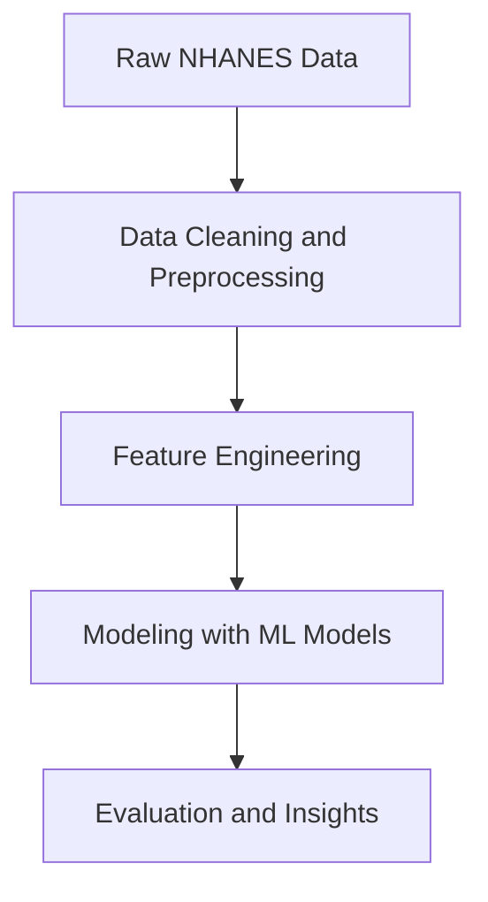

#  Health Insights from NHANES | Week 4 Hackathon Challenge

This project leverages the **National Health and Nutrition Examination Survey (NHANES)** dataset — a large-scale health study conducted by the CDC — to uncover patterns in health outcomes using machine learning and data analysis.

>  NHANES is a *nationally representative survey* that combines interviews and physical examinations to assess the health and nutritional status of adults and children in the United States.

---

##  Objective

Analyze NHANES data to build predictive models and gain actionable insights on public health indicators. The specific task for this challenge focuses on:
- **Preprocessing raw health data**
- **Handling missing values and outliers**
- **Training ML models (e.g., XGBoost, Logistic Regression)**
- **Evaluating predictive performance**

---

##  Dataset Overview

The dataset contains a rich mix of:
- **Demographic data** (age, gender, income)
- **Dietary intake**
- **Medical conditions** (diabetes, hypertension)
- **Physical activity**
- **Lab test results**

---

##  Workflow Overview

